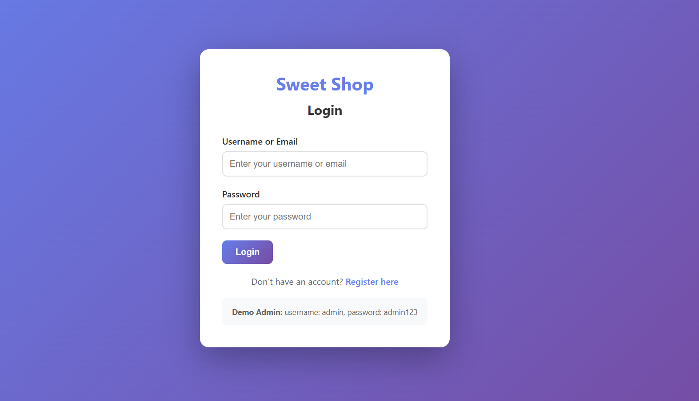
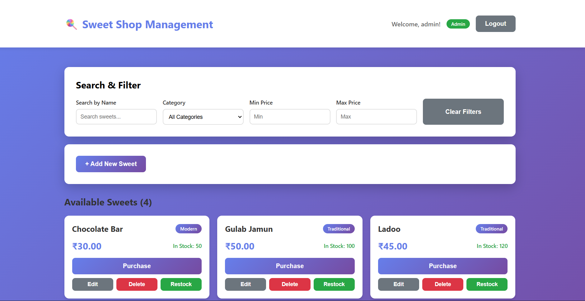

# 🍭 Sweet Shop Management System

A simple full-stack web application for managing a sweet shop inventory. Built with React (frontend) and Node.js/Express (backend).

## 📋 Features

- User registration and login
- View all available sweets
- Search and filter sweets by name, category, and price
- Purchase sweets (decreases inventory)
- Admin panel to add, edit, delete, and restock sweets

## 🚀 Quick Start

### Prerequisites

- Node.js (v14 or higher)
- npm (comes with Node.js)

### Backend Setup

1. Navigate to backend folder:
```bash
cd backend
```

2. Install dependencies:
```bash
npm install
```

3. Start the server:
```bash
npm start
```

The server will run on `http://localhost:3001`

**Default Admin Credentials(for testing only):**
- Username: `admin`
- Password: `admin123`

### Frontend Setup

1. Navigate to frontend folder:
```bash
cd frontend
```

2. Install dependencies:
```bash
npm install
```

3. Start the React app:
```bash
npm start
```

The app will open at `http://localhost:3000`

## 📸 Screenshots

### Login Page


### Dashboard - View All Sweets


### Search and Filter Functionality


### Purchase Flow


## 📁 Project Structure

```
Sweet_shop/
├── backend/
│   ├── server.js          # Single-file backend (all API code here)
│   ├── package.json
│   ├── tests/             # Test files
│   └── .gitignore
│
└── frontend/
    ├── src/
    │   ├── App.js         # Main React component
    │   ├── components/    # React components
    │   └── services/      # API service
    └── package.json
```

## 🧪 Running Tests

From the backend folder:
```bash
npm test
```

## 📚 API Endpoints

### Authentication
- `POST /api/auth/register` - Register new user
- `POST /api/auth/login` - Login user

### Sweets (Requires Login)
- `GET /api/sweets` - Get all sweets (supports ?search, ?category, ?minPrice, ?maxPrice)
- `GET /api/sweets/search` - Search sweets
- `GET /api/sweets/:id` - Get single sweet
- `POST /api/sweets` - Add sweet (Admin only)
- `PUT /api/sweets/:id` - Update sweet (Admin only)
- `DELETE /api/sweets/:id` - Delete sweet (Admin only)

### Inventory
- `POST /api/sweets/:id/purchase` - Purchase sweet (decreases quantity)
- `POST /api/sweets/:id/restock` - Restock sweet (Admin only, increases quantity)

## 🤖 My AI Usage

### AI Tools Used

I used **GitHub Copilot** and **Cursor AI** (Claude) to help build this project.

### How I Used AI

1. **Initial Project Setup**: The AI helped create the basic project structure with Express server and React frontend.

2. **Code Generation**: The AI assisted in generating:
   - Express route handlers for all API endpoints
   - React components for authentication and dashboard
   - CSS styling for a modern, responsive UI

3. **Debugging**: When I encountered errors, the AI helped identify and fix issues in the code.

4. **Code Explanation**: The AI explained complex concepts like authentication, API design, and React state management in simple terms.

### AI's Impact on My Workflow

- **Faster Development**: AI helped write boilerplate code quickly
- **Learning Tool**: The AI explained code as it generated it
- **Error Resolution**: AI quickly identified problems and suggested fixes
- **Best Practices**: AI suggested modern JavaScript/React patterns

### Reflection

Using AI was extremely helpful as a beginner. It allowed me to build a complete full-stack application efficiently while learning along the way.

## 📝 Notes

- The database uses SQLite (sweet_shop.db file)
- All API endpoints require authentication except registration and login
- Admin users can manage sweets; regular users can only view and purchase
- The frontend automatically handles authentication tokens

## 🛠️ Technologies Used

- **Backend**: Node.js, Express.js, CORS
- **Frontend**: React, React Router, Axios
- **Testing**: Jest, Supertest

## 📄 License

ISC

---

**Note**: This is a beginner-friendly project. The backend is intentionally kept in a single file (`server.js`) to make it easier to understand and modify.

